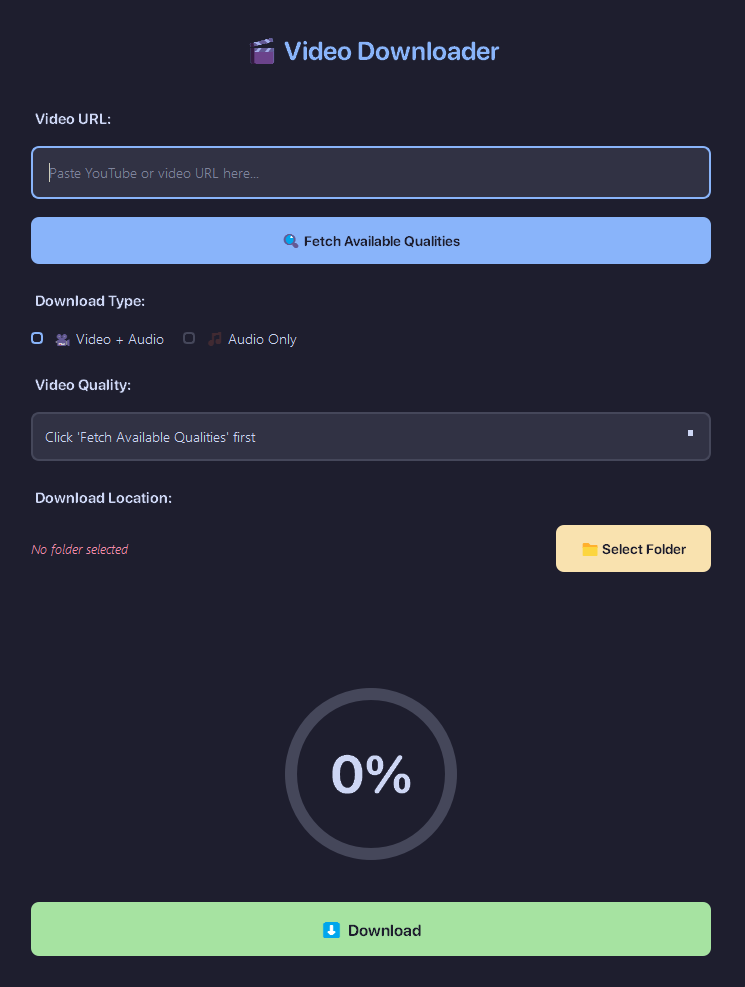

# GrabYt

A clean and modern desktop video downloader with quality selection and a circular progress indicator. Built with Python and PyQt5.



## Features

- Download videos in multiple quality options
- Audio-only downloads (MP3 format)
- Choose custom save locations
- Modern dark UI with circular progress bar
- Automatic quality detection

## Requirements

- Python 3.7+
- PyQt5
- yt-dlp
- FFmpeg

## Installation

Clone the repository:
```bash
git clone https://github.com/Zerraf-Badreddine/grabyt.git
cd grabyt
```

Install dependencies:
```bash
pip install -r requirements.txt
```

Install FFmpeg:
- **Windows:** Download from [ffmpeg.org](https://ffmpeg.org/download.html) and add to PATH
- **macOS:** `brew install ffmpeg`
- **Linux:** `sudo apt install ffmpeg`

## Usage

Run the application:
```bash
python grab_yt.py
```

1. Paste a video URL
2. Click "Fetch Available Qualities"
3. Select video or audio-only mode
4. Choose quality (if video mode)
5. Select download folder
6. Click Download

## Creating an Executable

Install PyInstaller:
```bash
pip install pyinstaller
```

Build the executable:
```bash
pyinstaller --onedir --windowed --name GrabYt grab_yt.py
```

The executable will be in `dist/GrabYt/`. Make sure to include FFmpeg in the same folder when distributing.

For a single-file executable:
```bash
pyinstaller --onefile --windowed --name GrabYt grab_yt.py
```

## requirements.txt

```
PyQt5>=5.15.0
yt-dlp>=2023.0.0
```

## Troubleshooting

**FFmpeg not found:** Ensure FFmpeg is installed and in your system PATH, or place it in the same folder as the application.

**Quality options not appearing:** Check your internet connection and verify the URL is valid.

**Progress bar not updating:** Restart the application and try again.

## License

MIT License - See LICENSE file for details.

## Disclaimer

For personal use only. Respect copyright laws and platform terms of service. Only download content you have permission to access.

---
